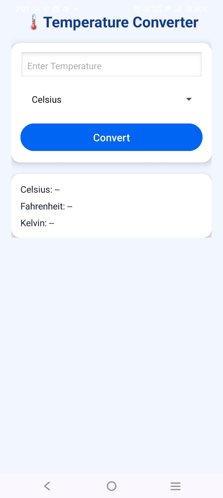
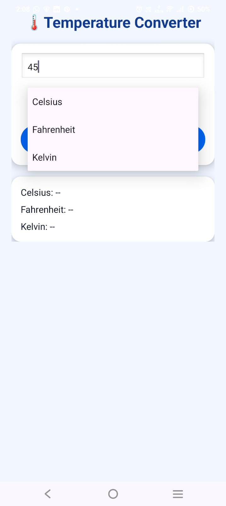
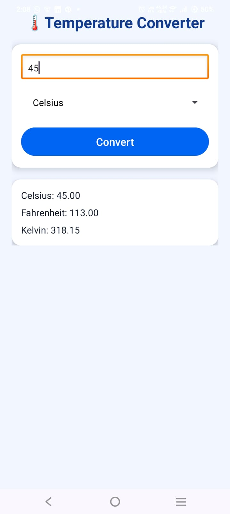

# 🌡️ Temperature Converter Android App

A clean, modern, and beginner-friendly Android application that converts temperature values between *Celsius, **Fahrenheit, and **Kelvin*.

This project is built using *Java and XML* in *Android Studio* and demonstrates UI design, user input handling, and basic mathematical logic.

---

## 📱 App Features

- 🔄 Convert temperature between Celsius, Fahrenheit & Kelvin
- 🎯 Simple and intuitive user interface
- 🎨 Modern card-based UI design
- 📐 Accurate conversion formulas
- 🧑‍🎓 Beginner-friendly and well-structured code

---

## 🛠️ Tech Stack

- *Language:* Java
- *UI Design:* XML
- *IDE:* Android Studio
- *Version Control:* Git & GitHub

---

## 📸 Screenshots

### 🏠 Home Screen


### ✍️ Input & Unit Selection


### 📊 Conversion Result


> 📌 All screenshots are stored in the screenshots/ folder at the project root.

---

## 📂 Project Structure

Temperature-Converter-Android/ │── app/ │── gradle/ │── screenshots/ │   ├── home_screen.png │   ├── input_screen.png │   └── result_screen.png │── README.md │── build.gradle

---

## ▶️ How to Run the Project

1. Clone the repository:
   ```bash
   git clone https://github.com/anamshaikh-dev/Temperature-Converter-Android.git